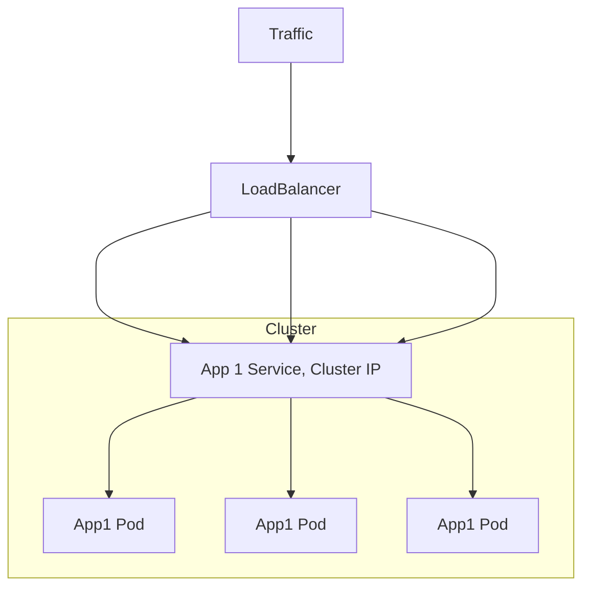
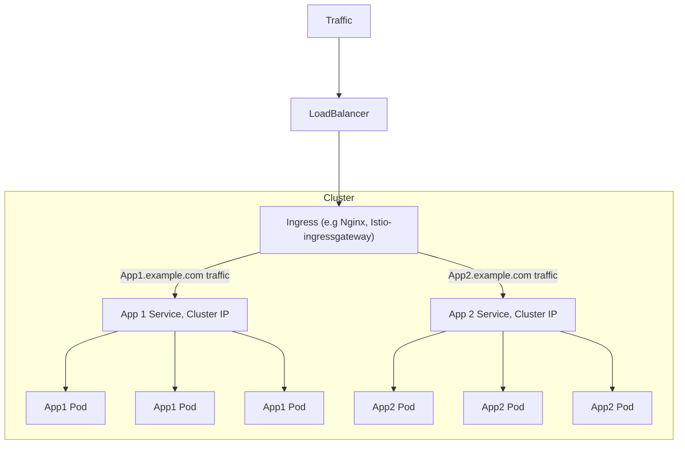

# Load balancer 줄이기

## LoadBalancer

Loadbalancer 타입의 서비스는 서비스를 생성함과 동시에 로드밸런서를 새롭게 생성하여 서비스와 연결합니다. 로드밸런서를 생성하는 기능을 제공하는 환경, 즉 클라우드 공급자가 제공하는 환경에서 사용 가능하며, 온프레미스 환경 같은 경우는 MetalLB 등으로 사용 가능하다고 함



서비스에는 ClusterIP가 역시나 할당된다. 

```yaml
apiVersion: v1
kind: Service
metadata:
  name: httpbin-test
  labels:
    app: httpbin-test
    service: httpbin-test
spec:
  ports:
    - name: http
      port: 8000
      targetPort: 80
    - name: http2
      port: 8001
      targetPort: 81
    - name: http3
      port: 8002
      targetPort: 82
    - name: http4
      port: 31602
      targetPort: 82
  selector:
    app: httpbin-test
  type: LoadBalancer
```

예를들어 위와 같이 셋업하여 LB를 생성하면 클라우드공급자가 NodePort 범위에서 랜덤하게 각 port(서비스 포트)에 대한 포트를 개방하는데. 이 포트를 통해서 파드에 접근 할 수 있습니다. 일종의 NodePort라고 할 수 있고. EKS의 경우에는 생성 하는 경우 자동으로 보안그룹까지 생성되어 해당 노드,포트로 트래픽이 들어 갈 수 있도록 inbound를 열게 됩니다.

### 로드밸런서를 몇개나 생성해야 할까

만약 클라우드 공급자의 K8s 서비스를 사용하는 와중에 여러 서비스를 외부에 노출 해야 할 때. 각 서비스별로 로드밸런서를 생성하는것은 매우 비효율적일것이다. 

이 때 필요한것이 바로  Ingress, IngressClass이다.

Ingress는 여러 서비스드를 하나로 묶는 일종의 라우터 역할을 하는데. nginx, istio-ingressgateway 등을 사용한다. 

LB로 부터 들어오는 traffic을 Ingress 가 먼저 수신하고. 내부적으로 정의된 URI, port 등의 정보를 기반으로 Service객체에 트래픽을 전달하는 역할을 한다.

이렇게 함으로서 소수의 LB로부터(혹은 1개) 여러 서비스에 대해서 클러스터 외부에 서비스를 노출시킬 수 있다.




## Numble

ingress를 사용하기위해 istio 를 셋업하고. istio ingrsss gateway 에서 포트별로 서비스에 대한 트래픽을 라우팅해주도록 작업하였다!

```yaml
apiVersion: install.istio.io/v1alpha1
kind: IstioOperator
metadata:
  name: istio
  namespace: istio-system
spec:
  profile: default
  components:
    egressGateways:
      - name: istio-egressgateway
        enabled: true
        k8s:
          hpaSpec:
            minReplicas: 1
    ingressGateways:
      - name: istio-ingressgateway
        enabled: true
        k8s:
          hpaSpec:
            minReplicas: 1
          serviceAnnotations:
            service.beta.kubernetes.io/ncloud-load-balancer-layer-type: "nlb"
            service.beta.kubernetes.io/ncloud-load-balancer-internal: "false"
          service:
            ports:
              - port: 80
                targetPort: 8080
                name: http2
              - port: 443
                targetPort: 8443
                name: https
              # 현재 도메인을 사용하지 않는 상태에서, 앱을 ingress를 통해 노출하기 위해 
              - name: argocd
                port: 30001
                targetPort: 30001
              - name: nginx
                port: 30002
                targetPort: 30002
              - name: kibana
                port: 30003
                targetPort: 30003
              - name: grafana
                port: 30004
                targetPort: 30004
```

```yaml
apiVersion: networking.istio.io/v1alpha3
kind: Gateway
metadata:
  name: istio-gateway
  namespace: istio-system
spec:
  selector:
    istio: ingressgateway
  servers:
    - port:
          number: 30001
          name: argocd
          protocol: HTTP
      hosts:
        - "*"
    - port:
          number: 30002
          name: nginx
          protocol: HTTP
      hosts:
        - "*"
    - port:
          number: 30003
          name: kibana
          protocol: HTTP
      hosts:
        - "*"
    - port:
          number: 30004
          name: grafana
          protocol: HTTP
      hosts:
        - "*"
---
apiVersion: networking.istio.io/v1alpha3
kind: VirtualService
metadata:
  name: istio-virtualservice
  namespace: istio-system
spec:
  gateways:
    - istio-gateway
  hosts:
    - "*"
  http:
    - match:
      - authority:
          exact: "istio-syste-istio-ingres-86eca-16974564-ed4c34960e26.kr.lb.naverncp.com:30001"
        port: 30001
      route:
        - destination:
            host: argocd-server.argocd.svc.cluster.local
            port:
              number: 80
    - match:
      - authority:
          exact: "istio-syste-istio-ingres-86eca-16974564-ed4c34960e26.kr.lb.naverncp.com:30002"
        port: 30002
      route:
        - destination: 
            host: nginx-service.nginx.svc.cluster.local
            port:
              number: 80
    - match:
      - authority:
          exact: "istio-syste-istio-ingres-86eca-16974564-ed4c34960e26.kr.lb.naverncp.com:30003"
        port: 30003
      route:
        - destination: 
            host: kibana-eck-kibana-kb-http.elastic-system.svc.cluster.local
            port:
              number: 5601
    - match:
      - authority:
          exact: "istio-syste-istio-ingres-86eca-16974564-ed4c34960e26.kr.lb.naverncp.com:30004"
        port: 30004
      route:
        - destination: 
            host: kube-prometheus-stack-grafana.kube-prometheus-stack.svc.cluster.local
            port:
              number: 80
```