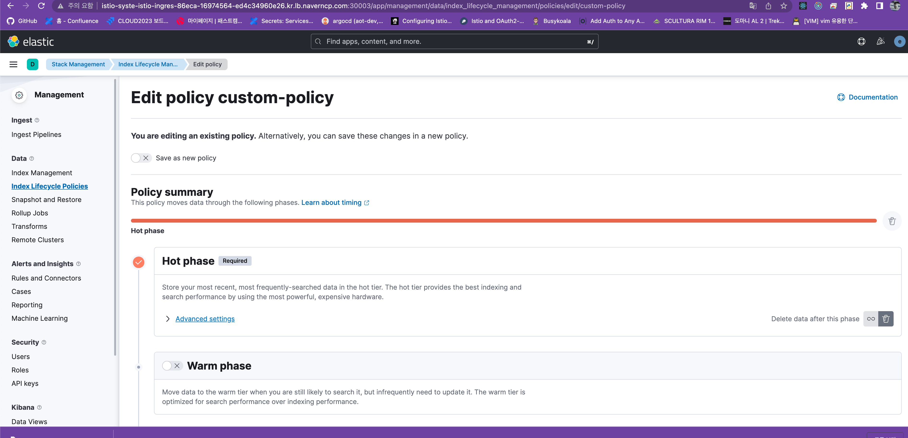
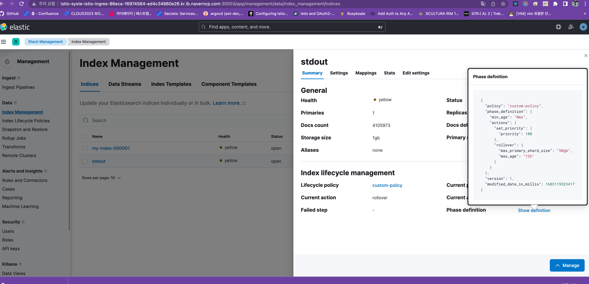

# Retention

Index에 Index lifecycle policy 를 연결하여 log retention 을 조절 할 수 있습니다. 

ref : https://www.elastic.co/guide/en/elasticsearch/reference/current/index-lifecycle-management.html

이것을 `ConfigMap` 으로 만들어서 beats / es 설치시 policy들을 코드 기반으로 관리도 가능합니다. 웹 콘솔에서도 진행 가능합니다.

